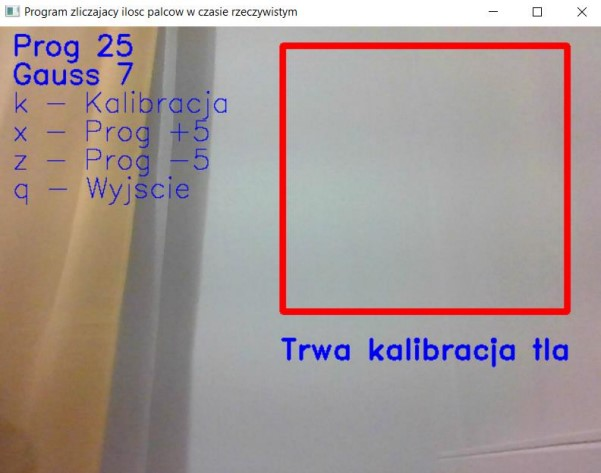
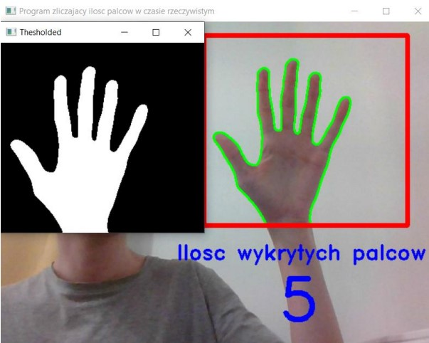

# Gesture-Recognition-Using-Image-Processing

The aim of the project is to create a window application that will enable finger counting 
of one hand in real time. The work will implement appropriate 
image-processing algorithms so that, as a result of the operation, the output will be 
hand shape will be obtained as the output. The next step will be to apply an algorithm that, from the perimeter
will be able to detect the number of fingers shown by the user. The entire programme will be 
made on the basis of a single OpenCV library for tasks related to 
image processing.

## Image processing algorithm with description

### Approach 1 - main approach, using the following steps to process the ROI window:
1. Conversion of the image from BGR to greyscale format.
2. Gaussian blurring to remove noise.
3. Calculation of the absolute difference between the current frame and the background.
4. Image rectification.
5. Outline drawing.

## Finger-counting algorithm with description

### Approach 1 - the main one, using the following steps to count the number of fingers:
1. We create a variable storing the four outermost points.
2. We find the centre of the hand.
3. We calculate the distances between the centre and the maximum points.
4. Draw a circle centred at the coordinates of the centre of the hand.
5. Count the fingers under two assumptions: the area of the contour is not the lower part of the hand
and the number of points along the contour does not exceed 25% of the circumference of the circle.

